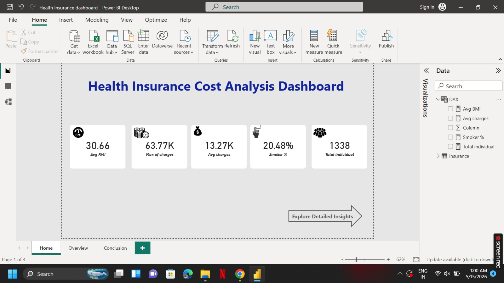
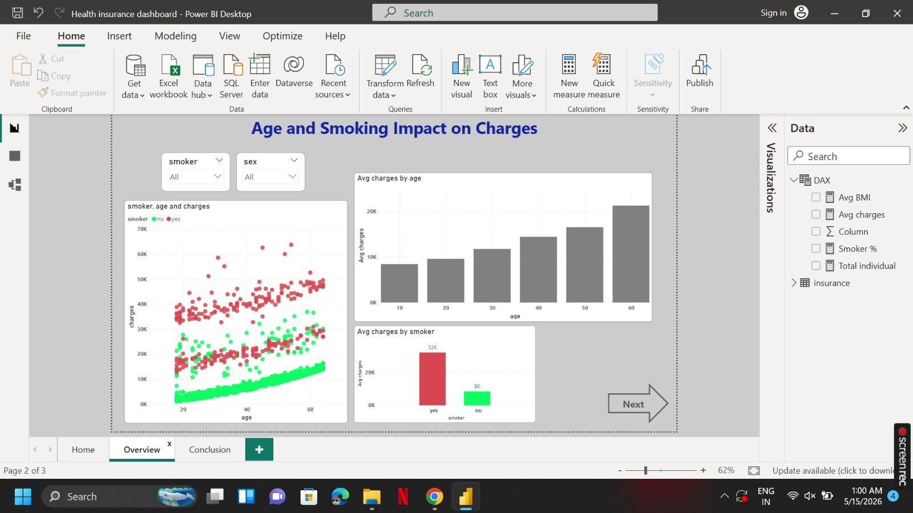
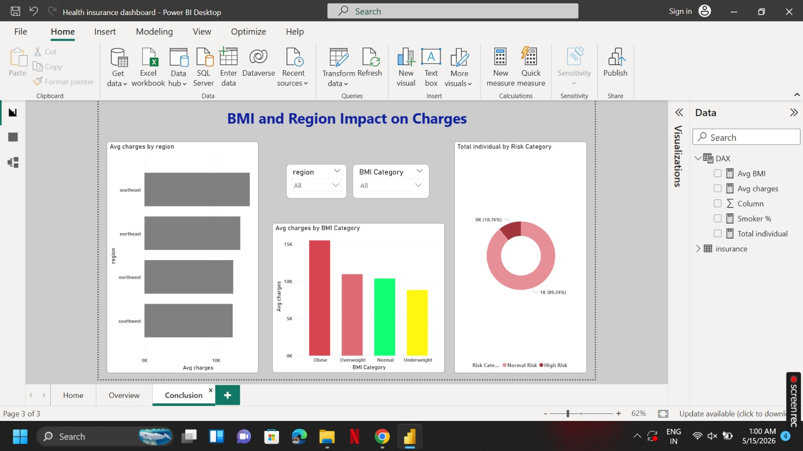

# Health Insurance Data Analysis

## Project Overview
Analyzed a Kaggle health insurance dataset using Python, SQL, Excel, and Power BI to examine how demographic and lifestyle factors impact medical insurance charges.

The project focuses on identifying cost-driving factors, analyzing customer demographics, and visualizing healthcare expense trends through interactive dashboards and data analysis techniques.

## Tools & Technologies Used
- Python
- Pandas
- NumPy
- SQL
- Excel
- Power BI
- Matplotlib
- Seaborn

## Key Features
- Insurance Cost Analysis
- BMI and Smoking Impact Analysis
- Region-wise Medical Charge Comparison
- Demographic Trend Analysis
- Interactive KPI Cards and Filters
- Excel Pivot Table Summary

## Data Analysis Process
- Cleaned and processed dataset using Python and SQL
- Performed Exploratory Data Analysis (EDA)
- Created Pivot Tables and summaries in Excel
- Built Power BI dashboard visualizations
- Analyzed relationships between lifestyle factors and insurance charges

## Key Insights
- Smoking was identified as a major factor contributing to higher insurance charges
- Higher BMI showed strong correlation with increased medical expenses
- Regional and demographic variations affected healthcare costs
- Visual analysis helped identify key cost-driving patterns

## Dashboard Preview

### Dashboard Overview

## Project Files
- Health Insurance Dashboard.pbix
- Health Insurance Dataset.csv
- Dashboard Screenshots
